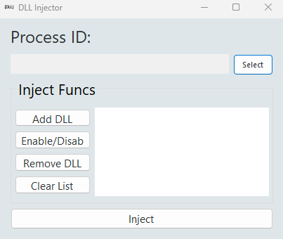
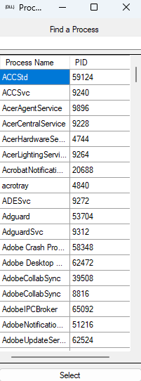

# 💉 DLL Injector GUI

A lightweight Windows Forms application for safe, manual DLL injection into running processes.  
Ideal for developers, students, and reverse engineers looking to understand how `LoadLibraryA` injection works under the hood — all through a clean graphical interface.

> ✅ 100% safe & educational — no malware, no hooks.

## 🚀 Getting Started

1. Build the solution in **Visual Studio** (Debug or Release)
2. Make sure your DLL and target process are built for the **same architecture** (x86/x64)
3. Run the injector as **Administrator**
4. Select a process, add your `.dll` file(s), and inject!

### Example DLL included in Release:
✅ `TestMessageDLL_x64.dll` – displays a MessageBox upon injection

## 📦 Features

- 🧠 Clean and intuitive Windows Forms GUI
- 🔍 Built-in process selector with search
- ➕ Add multiple DLLs with toggleable status (Enable/Disable)
- 🗑 Remove or clear DLL list
- 🚀 Inject only enabled DLLs
- 🧩 Uses `LoadLibraryA` + `CreateRemoteThread` via WinAPI
- 📜 Full logging and error reporting (e.g. PID, access denied, invalid architecture)

## 🛠 Technologies Used

- 💻 C# (WinForms)
- 🧠 P/Invoke for native WinAPI calls
- 🪟 Windows 10/11 Compatible
- 🛡 Manual injection method

## 📁 Project Structure

```
/DLLInjector/
├── MainForm.cs              # Main injector window
├── ProcessSelectorForm.cs   # Process list dialog
├── Program.cs
├── icon.svg                 # Minimal custom icon
├── README.md
└── TestMessageDLL/          # Sample C++ DLL project
    ├── dllmain.cpp
    └── x64/Release/TestMessageDLL.dll
```

## 🧪 TestMessageDLL

The included C++ test DLL (`TestMessageDLL.dll`) simply shows a MessageBox when injected, confirming success.

### It's code looks like:

```cpp
#include <Windows.h>

BOOL APIENTRY DllMain(HMODULE hModule,
                      DWORD  ul_reason_for_call,
                      LPVOID lpReserved)
{
    if (ul_reason_for_call == DLL_PROCESS_ATTACH)
    {
        MessageBoxA(NULL, "Injected successfully!", "Test DLL", MB_OK | MB_ICONINFORMATION);
    }
    return TRUE;
}
```

## ⚠️ Requirements & Notes

- You **must run the injector as Administrator**
- DLL and process architectures **must match** (x86 to x86 or x64 to x64)
- Not all processes can be injected (e.g., protected system processes, anti-cheat-protected apps)
- Some processes may block `CreateRemoteThread` (you'll see error code 5 = `Access Denied`)

## 🖼 Screenshots

### 💉 Injector GUI



### 🔎 Process Selector



## 📘 License

This project is for educational and testing purposes only.  
The author is not responsible for any misuse.
